# CyberGuard: AI-Powered Cybersecurity Chatbot

## Introduction 
Cybersecurity threats are evolving rapidly, requiring adaptive and intelligent defense mechanisms. **CyberGuard** addresses this need by integrating *Language Understanding Models (LUM)*, *Diffusion Models* for threat forecasting, and *Retrieval-Augmented Generation (RAG)* to deliver real-time, context-aware cybersecurity insights. Designed with a *microservices architecture* and deployed using *DevOps/MLOps practices*, CyberGuard ensures scalability, maintainability, and rapid deployment.

### Objectives  
- **Develop a Cybersecurity Chatbot:** Provide intelligent, real-time responses to cybersecurity queries.  
- **Implement Diffusion Models:** Predict the spread of cybersecurity threats in network environments.  
- **Leverage LUM:** Use models like *Google Gemini Pro* for accurate understanding of user inputs.  
- **Enhance Responses with RAG:** Combine data retrieval and AI generation for context-rich answers.  
- **Adopt Microservices Architecture:** Ensure modularity and scalability.  
- **Integrate DevOps/MLOps Practices:** Enable CI/CD, model management, and automation.

## RAG Model  

### Overview  
The RAG microservice uses *Google Generative AI (Gemini Pro)* for advanced natural language understanding and integrates a document retrieval system for precise, context-aware answers. 

### Key Features  
- Combines AI-generated responses with real-time document retrieval for accuracy.  
- Leverages *Gemini Pro* for natural language comprehension.  
- Loads and processes cybersecurity PDFs for knowledge-rich answers.
- Stores user interactions with MongoDB.
- Uses REST API with CORS to returns AI-generated answers.

### Technology Stack  
- **Backend:** Python, Flask  
- **AI Models:** Google Generative AI (Gemini Pro)  
- **Vector Database:** Chroma  
- **Database:** MongoDB  

### How It Works
1. **PDF Processing:** Loads and splits cybersecurity PDFs into searchable chunks.  
2. **Data Embedding:** Uses *Google Generative AI embeddings* to encode the data.  
3. **Query Handling:** RAG model generates accurate, context-aware responses.  
4. **User Interaction:** REST API endpoints enable chatbot communication with the frontend.  

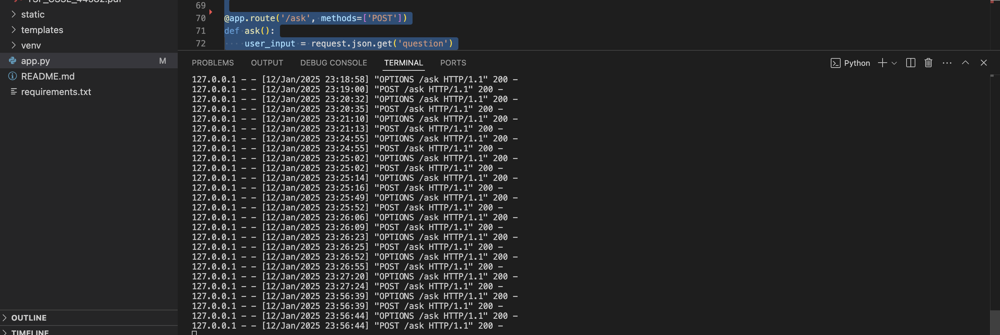  

## Diffusion Model  

### Overview  
The Diffusion Model simulates how cybersecurity threats spread across networks, providing proactive defense mechanisms for early threat detection.  

### Key Features  
- Visualizes the spread of cybersecurity threats.  
- Enables early detection for proactive defense.

### Technology Stack
- **Backend:** Python, Flask

### How It Works
1. **Threat Data Collection:** Gathers network threat data from various sources.
2. **Data Preprocessing:** Cleans and formats the data for model input.
3. **Model Simulation:** Tests the impact of any given IP address within the network on the entire network using the diffusion model.
4. **Visualization:** Displays the spread and impact of threats from the selected IP within the network.

## System Overview
- **Homepage:**
  
  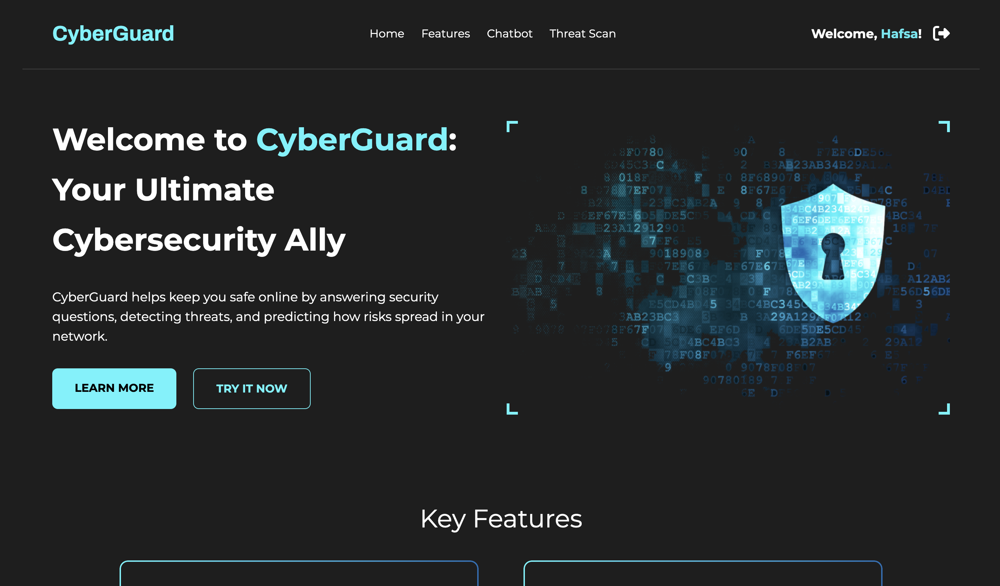  

- **User Registration:**
    
  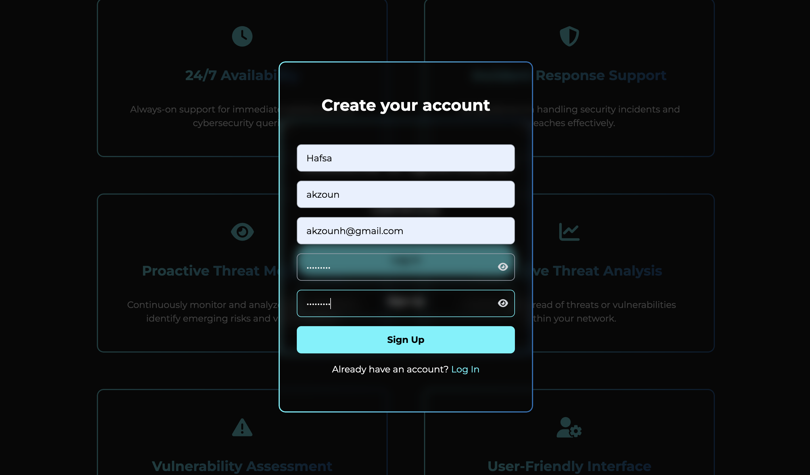  

- **User Login:**
  
  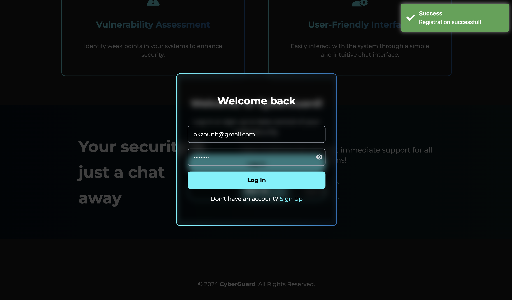  

- **ChatBot Interface:**
  
  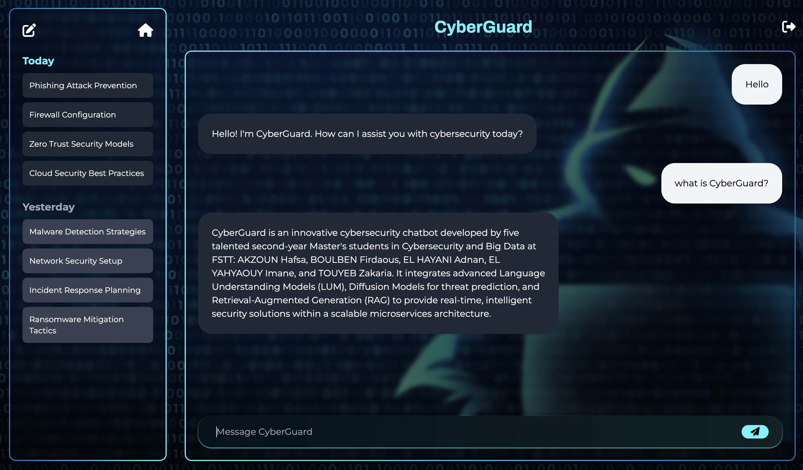  
  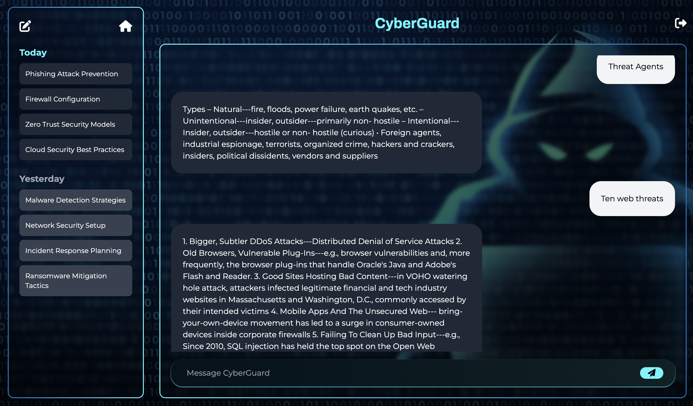
  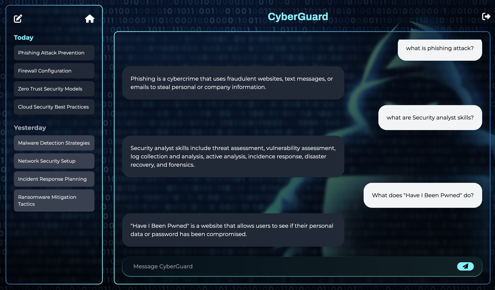   

- **Threat Analysis Interface:**  
  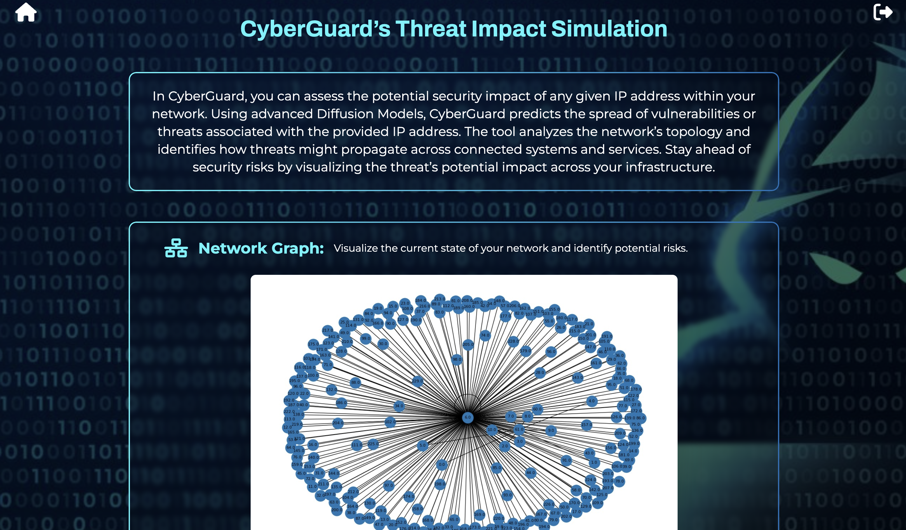

## System Implementation

### Frontend Development  
- **Angular:** Provides an interactive UI for seamless user interaction. 
- **Tailwind CSS:** Enhances the design process with a utility-first framework, allowing for rapid development of clean and adaptable UI components.

### Backend Development
- **Flask:** Hosts Python microservices for *RAG* and *Diffusion Models*.
- **Spring Boot:** Handles user authentication and registration using *JWT*.
  
  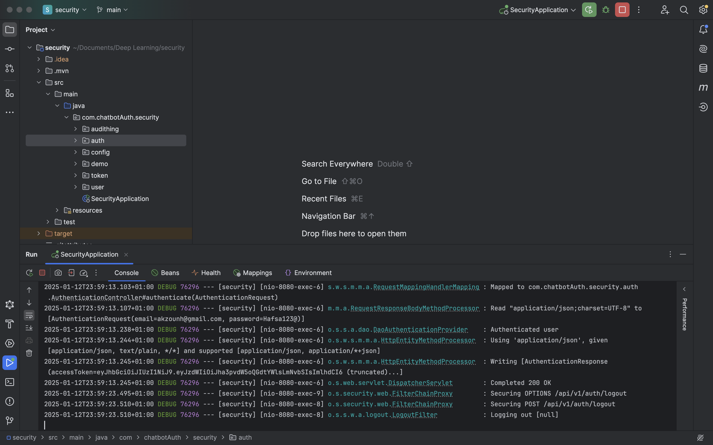
  
- **Postman:** API testing for authentication.
  
  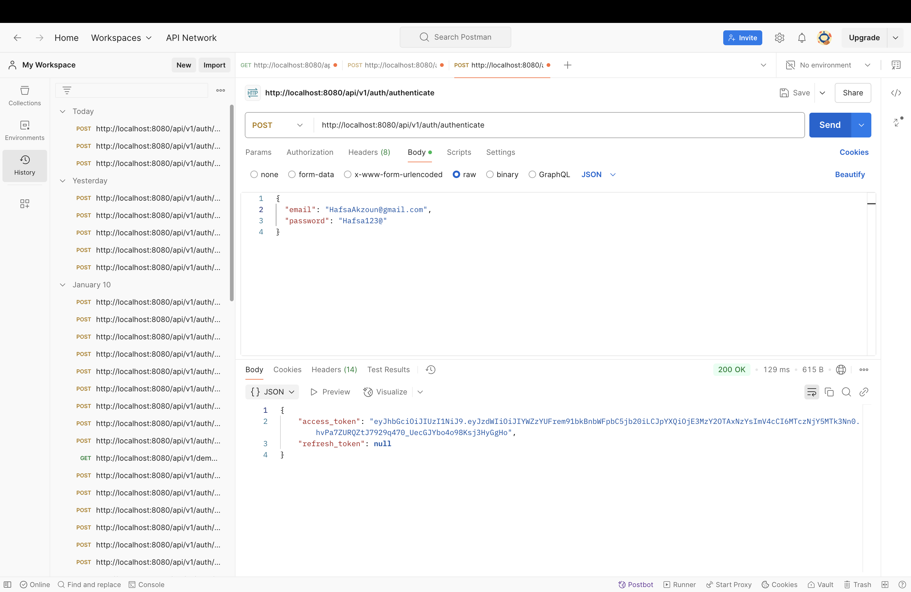
  
- **MongoDB:** Stores user data and session information.
    
  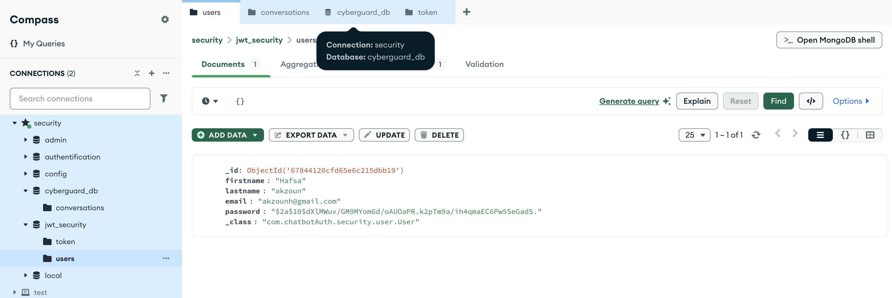  

### DevOps/MLOps Integration 
- **CI/CD Pipelines:** Automated testing and deployment with *GitHub Actions*.
- **Kubernetes:** Service orchestration for scalability. 
- **Docker:** Containerization for microservice isolation.
    
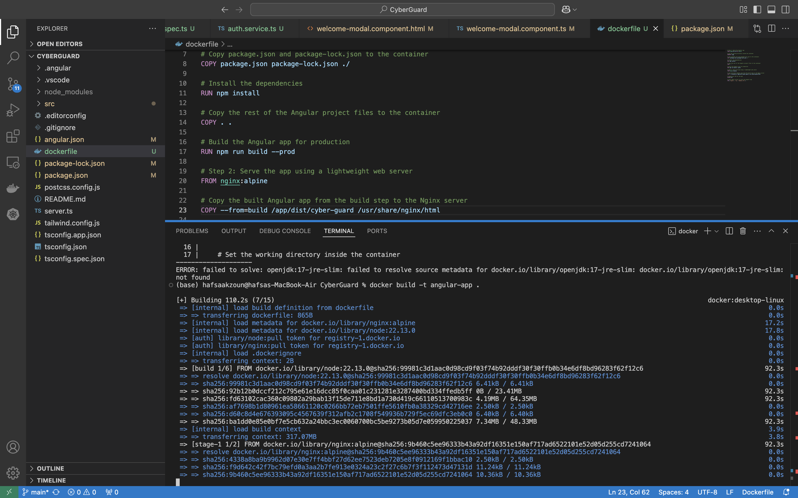  
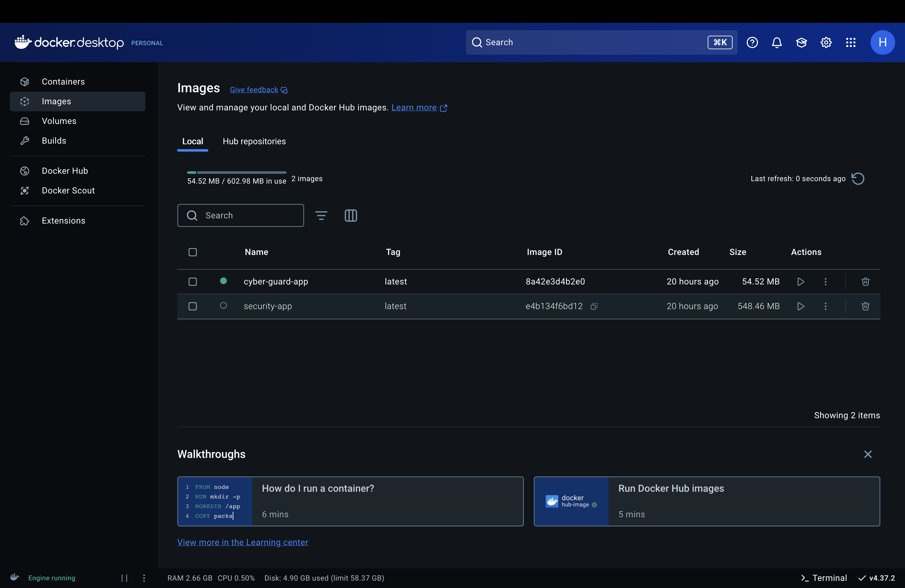

### Repository Links  
- Frontend: [CyberGuard Frontend](https://github.com/firdaous-boulben/CyberGuard.git)  
- Backend (Spring Boot): [ChatBot Security](https://github.com/hafsakzoun/ChatBoot-security.git)  
- RAG Model: [Chatbot RAG](https://github.com/adnanelhayani/chatbot_rag.git)  
- Diffusion Model: (To be added)  

### Setup Instructions  
1. Clone the repositories
2. Build Docker containers: <code>docker-compose up --build</code>
3. Deploy Kubernetes cluster: <code>kubectl apply -f k8s/</code>
4. Access the UI: http://localhost:4200

## Testing and Evaluation  
- **Functional Testing:** Verifies individual services work as expected.  
- **Integration Testing:** Ensures seamless interaction between services.  
- **Performance Testing:** Assesses system scalability and response time.  
- **Threat Prediction Accuracy:** Evaluates the effectiveness of the diffusion model.

## Conclusion 
**CyberGuard** successfully integrates *Language Understanding Models*, *Diffusion Models*, and *RAG* to deliver intelligent cybersecurity solutions. Its microservices architecture ensures scalability, and DevOps/MLOps practices streamline deployment. Future improvements could include expanding data sources, refining diffusion algorithms, and enhancing real-time incident response.

## Collaborators
**Team Members:**
- AKZOUN Hafsa
- BOULBEN Firdaous
- EL HAYANI Adnan
- EL YAHYAOUY Imane
- TOUYEB Zakaria

**Supervised by:** 
- Pr. EL AACHAK Lotfi

We welcome contributions through issues and pull requests.
